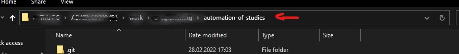

# Auto-Meetings

## Table of Contents
- [What makes it useful](#1)
- [Set up](#set-up):
  - [Linux (Ubuntu)](#L)
  - [Windows](#W)
 - [Commands](#Commands)

<a name="1"> <a/>
## What makes it useful:

- Searches on mailbox for mails with information about meetings.
- Saves links and dates of meetings in JSON.
- Saves links and dates you give as params using --add
- looks for the closest meeting
- joins meeting when it should and if user agreed, starts recording
- runs in the background
- can hibernate till next meeting, then hibernate till...

-------------------------------------------------
 
 
## Set up for Ubuntu:
 
1. Go to Auto-meetings directory and open there terminal  

1. Give set_up.sh permission: `sudo chmod +x set_up.sh` 

1. Run set_up.sh: `./set_up.sh` 

1. Then You can run the program: `./meetings.exe`

  
## Set up for Windows:

1. Go to Auto-meetings directory in file explorer  

1. Type `cmd` in the place where is path - it will open command prompt in the directory  

 

1. Run set_up.bat by typing in the terminal: `.\set_up.bat` 

1. Then You can run the program by typing `.\meetings.exe`

## Set up for obs-studio

**Tool for finishing recordins**
obs-studio -> Tools -> Output timer -> 

- ***Stop recording after*** `1` ***hour `45` minutes*** 

- - [x] ***Enable recording timer every time***

#### Set mkv 
*in case program crushing during recording*

obs-studio -> File -> Settings -> Output -> 

- ***Recording Format*** `mkv`

#### set Source
- turn off an eye icon next to Screen Capture
- turn on an eye icon next to your meeting app for example Zoom 

 *if you do not see Sources go to: *view -> Docks -> Sources*

 ---------------------------------------------------------
 
 
### Commands

You can run the program with parameters:

- `-h` or `--help` 
- `-a` or `--add "link" "date"` - where link is the link and date is the date of the meeting
- `-s` or `--sleep` - it is recommended to run with sudo
- `-r` or `--record`

***examples:*** 

`./meetings.exe --help`  

`sudo ./meetings.exe -s`

 -------------------------------------------------------------
 
### Disclaimer

- Internet connection is needed
- sudo is needed to hibernate PC
- if you want program to search for mails with meetings, you should have installed `Python3`
- PC in hibernated mode uses energy
- Program is designed for non-IT people, that's why .exe is in the repo. Despite this it is
 recommended to delete this file (new one will be generated after `./set_up.sh`, but you are sure what was compiled) 
